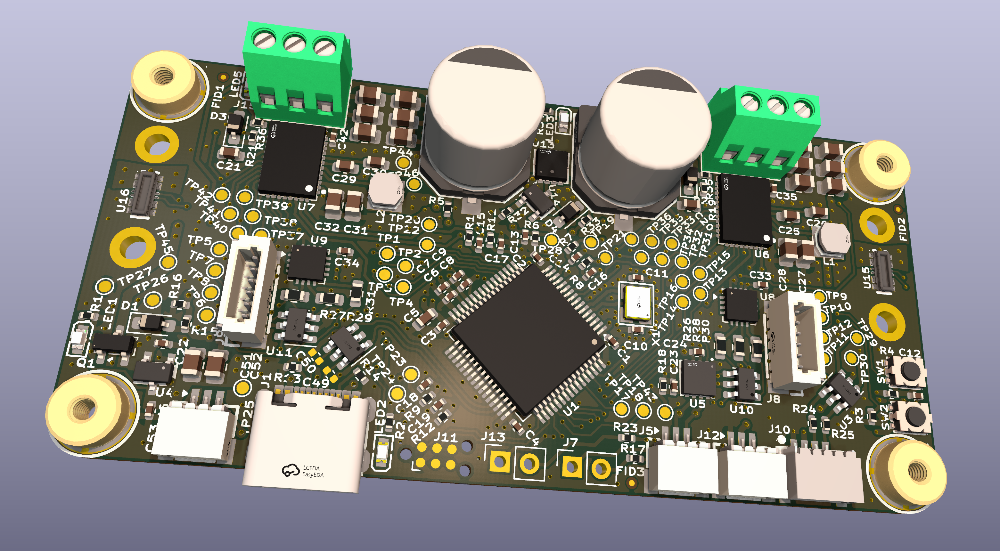

# twinspora

Dual-axis BLDC controller — twin DRV8316 motor drivers controlled by an STM32G473 with an onboard MT6701 magnetic encoder. Sized to fit two iPOWER GM2804 / Cubemars GL-30 motors on the back of the PCB.

## Specs

- **MCU:** STM32G473
- **Motor drivers:** 2× DRV8316
- **Encoder:** MT6701 onboard. Optional SPI breakout for remotely-mounted motors — desolder 3× 0603 resistors to switch over.
- **Connectivity:** CAN-FD, USB 2.0, I²C

## Power & decoupling

- Reverse-polarity protection on the supply input
- 2× 330 µF electrolytic bulk caps
- 12× 0805 ceramic footprints (6 per driver) for additional decoupling

## Protection

- ESD protection on every external connector

## Configuration

- Solder jumpers for CAN bus termination and I²C pull-ups
